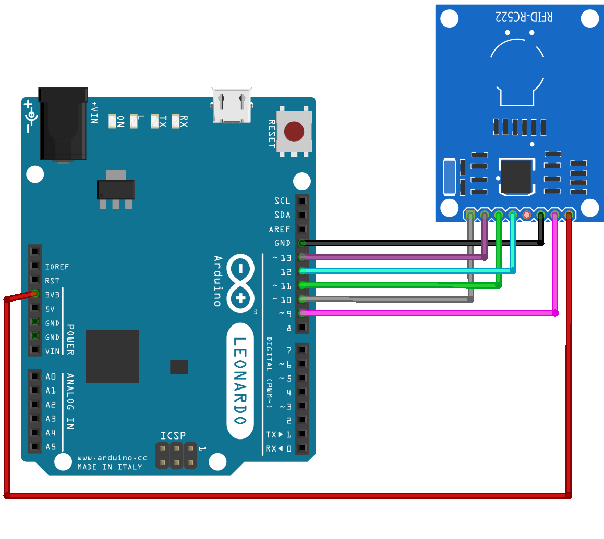

## Arduino RFID Cloner

### Requirements:
- Arduino UNO
- RC522 Module

### Schematics

| **RC522 Pin** | **Ardino Uno Pin** |
|:-------------:|:------------------:|
|      SDA      |     Digital 10     |
|      SCK      |     Digital 13     |
|      MOSI     |     Digital 11     |
|      MISO     |     Digital 12     |
|      IRQ      |    Not connected   |
|      GND      |         GND        |
|      RST      |      Digital 9     |
|     3.3 V     |        3.3 V       |

### Code
Download the [RCRF522 Library](https://www.arduino.cc/reference/en/libraries/mfrc522/) from the arduino marketplace and use its examples.

If you followed the schematics above, the library should work out of the box.
